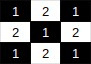

# Statement
Cho một bàn cờ vua kích thước $N*N$, trên mỗi ô của bàn cơ ghi một số nguyên dương không lớn hơn 100. Các hàng được đánh số từ 1 tới N từ trên xuống dưới, các cột được đánh số từ 1 tới N từ trái sang phải. Biết ô trái trên $(1,1)$ của bàn cờ vua là ô trắng (các ô trắng và các ô đen xen kẽ nhau). Nhiệm vụ của bạn là tìm độ chênh lệch giữa tổng giá trị các ô màu đen và các ô màu trắng trên 1 vùng nào đó, một vùng được xác định bằng 2 điểm (điểm trái trên và điểm phải dưới). 

Ví dụ:

Độ chênh lệch của vùng trên là $4*2 - 1*5 = 3$

Yều cầu: Cho mô tả bàn cờ vua, thực hiện $Q$ $(Q \le 10^4)$ truy vấn tính độ chênh lệch. 
# Input
- Dòng đầu tiên chứa số nguyên $N$
- $N$ dòng tiếp theo, mỗi dòng chứa $N$ số nguyên mô tả giá trị mỗi ô trên bản đồ
- Dòng thứ $N+2$ chứa số $Q$
- $Q$ dòng tiếp theo, mỗi dòng chứa 4 số nguyên $x$1, $y$1, $x$2, $y$2. Trong đó, ($x$1, $y$1) là ô trái trên, ($x$2, $y$2) là ô phải dưới của vùng cần tính
# Output
- Bao gồm $Q$ dòng, dòng thứ $i$ là giá trị của truy vấn $i$
# Example
Input | Output
--- | ---
4 1 3 5 7 2 4 6 8 9 11 13 15 10 12 14 16 2 3 2 4 3 1 1 2 3 | 0 1       