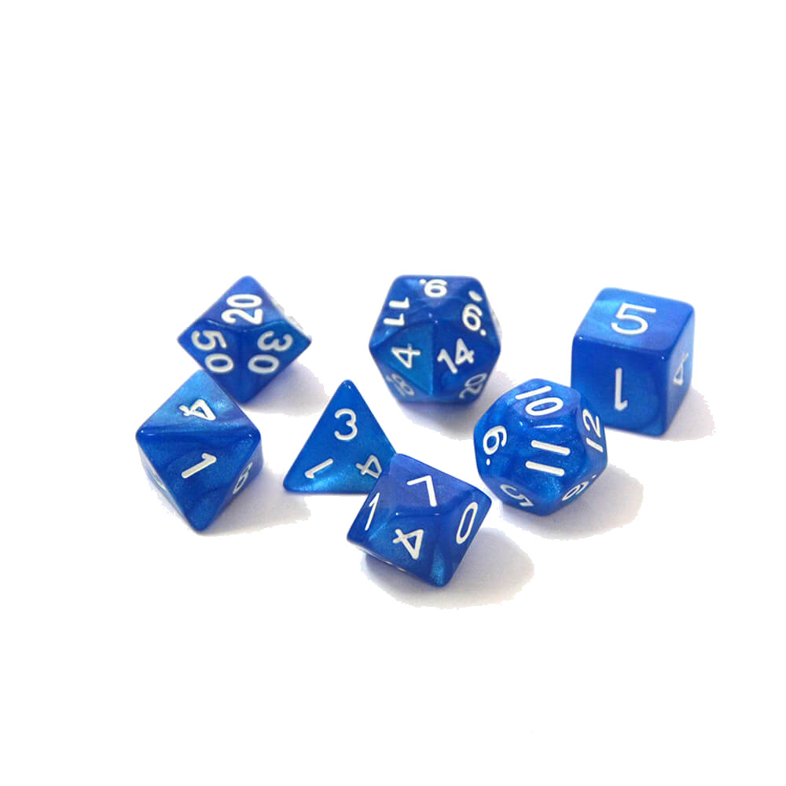

# Statement
Trọng một nghiên cứu liên quan đến 3 loại xúc sắc $C1, C2, C3$. Loại xúc sắc $Ci$ có $Si$ mặt $(1 \le Si \le 100)$, được đánh số từ $1 \rarr Si$. Người ta thả 3 loại xúc sắc liên tục và mỗi lần ghi lại 1 số là tổng giá trị thu được từ 3 loại. Giả xử xác suất xuất hiện mỗi mặt là như nhau, hãy tìm ra giá trị xuất hiện nhiều nhất khi biết số mặt của mỗi xúc sắc.

# Input
$S1, S2, S3$ ngăn cách bởi khoảng trống
# Output
Giá trị xuất hiện nhiều nhất
# Example
Input | Output
--- | ---
3 2 3 | 5