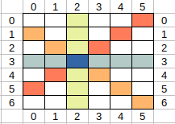

Với giới hạn các phần tử trong ma trận không vượt quá $10^7$ và kích cỡ của ma trận không vượt quá 100x100. Ta toàn toàn có thể tìm ra vị trí các số nguyên tố trong ma trận bằng cách sử dụng sàng nguyên tố.

Giả sử ta đã có vị trí các số nguyen tố, việc cần làm tiếp theo là xác định xem khóa cần tìm ở vị trí nào. Biết rằng các số nguyên tố có thể nối với nhau thành 1 đoạn thẳng nếu đoạn thẳng này song song với hàng, cột hoặc các đường chéo; và chỉ 2 trong số các đoạn thẳng này giao nhau tại khóa cần tìm. Nói cách khác, một điểm được coi là khóa nếu trên các hàng, cột, đường chéo đi qua nó tồn tại 2 đoạn thẳng chứa nó (không tính đầu mút). 

Trước tiên, ta sẽ xác định xem trên ma trận có thể có bao nhiều đường đi qua 1 điểm:

Nhìn vào ma trận, ta có thể thẩy 2 loại đường chéo: 
- Đường chéo loại 1: Có index là chỉ số (hàng + cột)
- Đường chéo loại 2: Có index là chỉ số (hàng - côt)

Như vậy, với mỗi tọa độ (r, c) trên ma trận. Ta có 4 đường đi qua (r, c) đó là: 
- Hàng (r) 
- Cột (c)
- Đường chéo loại 1 (r+c)
- Đường chéo loại 2 (r-c)

Tiếp theo, ta cần xác định xem trong 4 đường đi qua (r, c) tồn tại bao nhiêu đường chứa 2 số nguyên tố bao (r, c)? Nếu tồn tại 2 đường, ta có thể kết luận rằng vị trí (r, c) là khóa bí mật. Để thực hiện việc này ta có nhiều cách, một cách đơn giản là tìm khoảng (min, max) của hàng và cột của các số nguyên tố nằm trên đường và kiểm tra xem (r, c) có nằm trong 2 khoảng này không.  

Tổng kết lại, ta có thuật toán sau:

B1: Sàng nguyên tố trên đoạn $[1, 10^7]$

B2: Tìm ra các vị trí số nguyên tố, với mỗi vị trí (r, c) chứa số nguyên tố, ta cập nhật lại khoảng (min_row, max_row) và (min_col, max_col) cho 4 đường đi qua (r, c)

B3: Duyệt tất cả các vị trí trên ma trận, với mỗi vị trí (r, c) không là số nguyên tố thì đếm xem trong 4 đường đi qua có mấy đường thỏa mãn (r, c) nằm trong khoảng (min_row, max_row) và (min_col, max_col). Nếu có 2 đường thỏa mãn thì (r, c) là tọa độ đáp án.

Độ phức tạp cho thuật toán này là thời gian sàng nguyên tố: O(K*log(K)) với K = $10^7$

<!-- this css for latex -->

